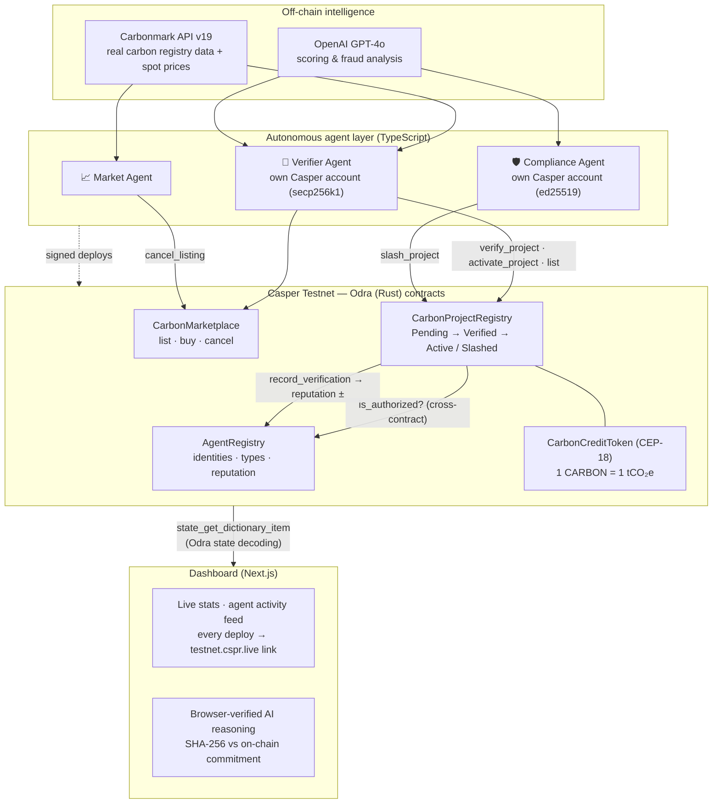
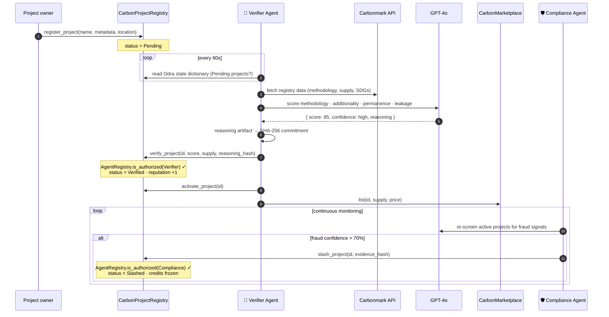
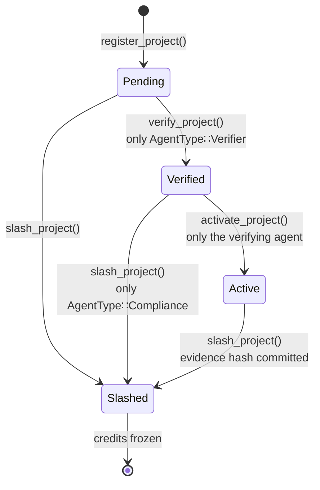

# Casper Carbon 🌱⬡

**Autonomous AI agents that verify, tokenize, police, and market-make real-world carbon credits — with every decision settled on the Casper Network.**

Casper Carbon is a working, end-to-end agentic RWA marketplace running on Casper Testnet today: four Odra smart contracts, three autonomous AI agents with distinct on-chain identities and reputations, and a live dashboard where every agent action links to a real, verifiable testnet deploy.

---

## Why this matters

Voluntary carbon markets move billions of dollars a year on top of infrastructure that is fundamentally broken:

1. **Verification is slow and opaque.** Certifying a single project takes 2–5 years of human auditing, and the methodology assessments live in PDFs nobody re-checks.
2. **Fraud is endemic and undetected.** Investigations have found that the majority of some registries' REDD+ credits did not represent real carbon reductions — because nothing monitors projects *after* certification.
3. **Nothing is publicly auditable.** Issuance, pricing, and retirement all happen inside private registry databases.

Casper Carbon replaces the human bottleneck with a **swarm of specialized, mutually-distrusting AI agents** whose powers are limited by smart contracts, whose reputations live on-chain, and whose every decision is committed to a public ledger:

- A **Verifier agent** scores projects against real registry data in minutes, not years.
- A **Compliance agent** — a *separate on-chain identity the verifier cannot impersonate* — continuously re-screens projects and autonomously slashes fraud.
- A **Market agent** keeps on-chain credit prices honest against a live real-world price oracle.
- Every AI judgment is **hash-committed on-chain** and independently verifiable in the browser.

This is the pattern real-world-asset tokenization needs: not "AI wrote a report," but *AI actors with cryptographic identities, contract-enforced permissions, economic reputations, and a public audit trail*.

---

## System architecture



**The trust model in one sentence:** the contracts, not the agents, are the source of authority — `verify_project` reverts unless the caller is registered as `AgentType::Verifier`, `slash_project` reverts unless the caller is `AgentType::Compliance`, and both checks happen via a cross-contract call to the AgentRegistry on every invocation.

---

## The verification lifecycle



### Project state machine (contract-enforced)



---

## Verifiable AI: reasoning you can audit

Most "AI + blockchain" demos ask you to trust the AI. Casper Carbon doesn't:

1. When the Verifier or Compliance agent makes a decision, it serializes the **complete LLM output** (score, confidence, full reasoning text / fraud evidence) to JSON.
2. The **SHA-256 of that exact JSON** is committed on-chain (`reasoning_hash` in the Project struct / the slash evidence hash).
3. The dashboard fetches the artifact, **recomputes the hash in your browser with WebCrypto**, and shows a *"✓ SHA-256 verified against on-chain commitment"* badge only if it matches, byte for byte.

Tamper with the reasoning after the fact and the badge breaks. The AI's judgment is as auditable as the transaction that recorded it.

---

## How this leverages Casper

| Casper capability | How Casper Carbon uses it |
|---|---|
| **Odra framework (Rust)** | All four contracts are Odra 2.8 modules — typed storage (`Var`, `Mapping`), enum state machines, cross-contract references (`AgentRegistryContractRef`), and unit tests against `odra_test`. |
| **Cross-contract authorization** | The registry calls `AgentRegistry.is_authorized()` on every verify/slash — agent permissions are enforced *by the chain*, not by agent code. |
| **On-chain agent reputation** | `record_verification()` mutates reputation from *inside* the contract call that used the agent's work — reputation is earned atomically with the action itself. |
| **Deploy model & entry-point introspection** | Agents fetch each contract's entry-point signatures from global state and type every argument (`U32`/`U8`/`U256`) to match — deploys are constructed against the chain's own ABI, then signed and submitted via `casper-js-sdk` v5. |
| **Native low-level state access** | Both the agents and the dashboard read contract state **trustlessly, with no indexer**: we reimplemented Odra's storage key derivation (`blake2b256(field_index ++ mapping_key)` into the contract's `state` dictionary) plus Casper `bytesrepr` decoding in TypeScript, and query `state_get_dictionary_item` directly. |
| **CSPR.cloud** | The dashboard's live activity feed streams the agent accounts' deploy history (with decoded entry points and args) from the CSPR.cloud REST API; every row links to `testnet.cspr.live`. |
| **x402 micropayments** | The agent library ships an x402 client (CSPR.cloud facilitator) so agents can pay per-request for premium data feeds — satellite imagery, news APIs — as they scale. |
| **CEP-18** | Carbon credits are standard fungible tokens (1 CARBON = 1 tCO₂e), mintable only by the registry contract, burnable by holders for retirement. |

---

## Deployed contracts (Casper Testnet)

| Contract | Hash |
|---|---|
| AgentRegistry | [`d6099edb…616ee6`](https://testnet.cspr.live/contract/d6099edb2284110b844258cc18f08ba76350aade9d0b5fd537d2091e45616ee6) |
| CarbonProjectRegistry | [`f1d3e8d2…4d648e`](https://testnet.cspr.live/contract/f1d3e8d2bd2f3cf057c61c3a5dd611a0d07d68bd77c6f296900b674fdd4d648e) |
| CarbonCreditToken (CARBON) | [`80039732…017324`](https://testnet.cspr.live/contract/800397323016eb8a1ba2a561691b8c81c2a025acdf2dbf41bf67839596017324) |
| CarbonMarketplace | [`b29905ce…1e5266`](https://testnet.cspr.live/contract/b29905ce578edcbe5abe83aa35c92c8a935af620cbb1ec45a36b66e2a21e5266) |

**Agent identities (live, on-chain, with reputation):**

| Agent | Public key | Type |
|---|---|---|
| Verifier / Market | `020335ce…2013` (secp256k1) | `AgentType::Verifier` |
| Compliance | `010531a6…b6d2` (ed25519) | `AgentType::Compliance` |

Everything above is real and inspectable: projects verified with live GPT-4o scores, listings created and cancelled by agents reacting to live Carbonmark prices, and a project autonomously slashed with hash-committed fraud evidence.

---

## The dashboard

| Page | What it shows |
|---|---|
| **Dashboard** | Live chain stats + the agent activity feed — every deploy by every agent, described in plain English, each with a `testnet.cspr.live` link. |
| **Projects** | Per-project status pipeline (Pending → Verified → Active / Slashed), AI score, credit supply, and the full GPT-4o reasoning with in-browser SHA-256 verification against the on-chain commitment. |
| **Marketplace** | On-chain listings vs the live Carbonmark spot price, spread in basis points, and which listings the market agent has delisted as mispriced. |
| **Agents** | The on-chain agent registry: identities, types, live reputation scores, and verification track records. |

All chain data is decoded server-side straight from Casper global state (8-second cache) — no database, no indexer, nothing to trust but the node.

---

## Quick start

### One-command demo

```bash
./demo.sh
```

Starts all three agents plus the dashboard with color-coded output, and opens `http://localhost:3000` when ready. Ctrl-C stops everything.

### Manual

```bash
# 0. One-time: configure secrets
cp agents/.env.example agents/.env      # add OpenAI + Carbonmark keys, key paths
cp scripts/.env.example scripts/.env
cp web/.env.example web/.env.local      # add CSPR.cloud token for the activity feed

# 1. (fresh chain only) deploy + wire + register agents
cd contracts && cargo odra build --backend casper
cd ../scripts && npm i && npm run deploy && npm run fix-setup

# 2. seed demo projects
npm run seed

# 3. run the agents (separate terminals)
cd ../agents && npm i
npm run verifier      # GPT-4o verification → on-chain deploys
npm run compliance    # fraud monitoring → autonomous slashing
npm run market        # live-price market making

# 4. dashboard
cd ../web && npm i && npm run dev   # → http://localhost:3000
```

### Verify the chain integration yourself

```bash
cd agents && npm run test:chain
```

Reads and decodes every project, listing, and counter from the live Odra state dictionary, then builds and signs (without submitting) all five deploy types against the contracts' on-chain entry-point signatures. All checks pass against Casper Testnet.

---

## Repository layout

```
├── contracts/          Odra (Rust) smart contracts + unit tests
│   └── src/            agent_registry · registry · token · marketplace
├── agents/             Autonomous agents (TypeScript)
│   ├── src/            verifier · compliance · market · test-chain-read
│   └── src/lib/        casper (Odra state R/W + typed deploys) · llm ·
│                       carbonmark · reasoning-store · x402-client
├── web/                Next.js dashboard (live chain state, no indexer)
│   ├── src/lib/        casper-read (dictionary decode) · csprcloud
│   └── src/app/        dashboard · projects · market · agents · api/*
├── scripts/            deploy · seed · fix-setup · verify
└── demo.sh             One-command demo runner
```

---

## Engineering notes worth reading

**Reverse-engineering Odra's storage layout.** Odra contracts don't expose state via named keys — everything lives in a single `state` dictionary keyed by `hex(blake2b256(be32(field_index) ++ mapping_key_bytes))`, with field indices assigned 1-based in struct declaration order. We derived this from the Odra macro source, reimplemented it in TypeScript (agents *and* dashboard), and validate it continuously against live testnet state — including raw `bytesrepr` decoding of length-prefixed `U256`, tagged `Address`, and `Option<u64>` fields.

**ABI-driven deploys.** Rather than hard-coding argument types, the agent library introspects each contract's entry points from global state and builds `CLValue`s to match the declared `cl_type`s. Wrong-typed arguments are impossible by construction.

**Separation of powers, cryptographically.** One compromised agent key cannot take over the system: the verifier's key physically cannot slash, the compliance key cannot verify, and both registrations (plus reputations) are public on-chain state.

---

## Roadmap

- ✅ **CSPR.click wallet integration** — buy credits in-browser with your own wallet; deploy params are built server-side and submitted client-side via CSPR.click (live on Marketplace).
- ✅ **Token flow completion** — registry-driven `mint()` on verification so listed credits are backed by transferable CEP-18 balances end-to-end (live in CarbonProjectRegistry + CarbonCreditToken).
- **x402-metered data feeds** — satellite canopy analysis and news APIs purchased per-request by the compliance agent, priced in CSPR.
- **Multi-verifier consensus** — N independent verifier agents with stake-weighted scoring; slashing burns agent stake, not just reputation.
- **Mainnet launch** — with real registry partnerships (Verra/Gold Standard bridged data) and institutional retirement reporting.

---

## Launch plan

| Step | Status |
|------|--------|
| Odra contracts deployed + unit tests passing | ✅ Live on testnet |
| All 3 agents running autonomously | ✅ Live |
| Dashboard with live chain state | ✅ Live |
| CSPR.click wallet integration | ✅ Live |
| Verifiable AI reasoning hashes | ✅ Live |

---

## v2 — Casper Agentic Buildathon 2026 Final Round

This update (July 2026) adds production-hardening, wallet integration, and polish ahead of the final round.

### Critical bug fixes
- **Marker → Market** — `AgentType::Marker` renamed to `AgentType::Market` across all contracts, agent files, and TypeScript types
- **Token minting on verification** — `CarbonProjectRegistry::verify_project` now calls `CarbonCreditToken::mint` so credits are minted atomically with verification
- **Approve step in listing** — `verifier.ts` calls `approve()` on the token contract before `list()` so the marketplace can transfer credits
- **Build fixed** — `Odra.toml` pinned to Casper backend, `.cargo/config.toml` added `--allow-undefined`, `rust-toolchain` set to nightly-2026-06-24, Odra deps pinned to `=2.8.0`

### Wallet integration (CSPR.click)
- `wallet.tsx` — React context + `useWallet` hook wrapping CSPR.click SDK
- `wallet-button.tsx` — `HeaderWallet` component in the nav bar; `WalletBar` + `BuyButton` on the marketplace page
- `build-buy` API route — returns unsigned deploy params for any listing
- `submit-deploy` API route — proxies the user-signed deploy to Casper RPC

### Agent live status
Dashboard shows green/gray dot per agent (Verifier, Compliance) based on whether a deploy was seen in the last 40 seconds — refreshed every 10s via CSPR.cloud.

### Verifiable AI hero section
New callout on the dashboard explaining the SHA-256 commitment model: every LLM judgment is hash-committed on-chain and verifiable in-browser.

### TypeScript safety
Removed all `as unknown as T` casts in `agents/src/lib/casper.ts` — replaced with typed union return and explicit `as Type` casts at call sites. Agents and web both compile with `tsc --noEmit`.

### Error states
Added `ErrorCard` and `EmptyState` shared components. Every page (dashboard, projects, agents, marketplace) now renders styled error cards on fetch failure and empty-state messages when data is absent.
